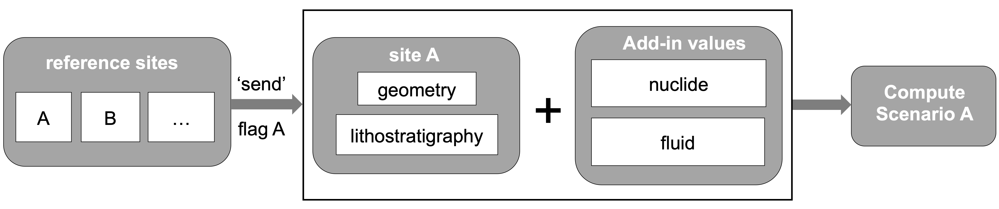

# Scenario-based Database
This document provides an overview of the file structure of yaml-db, details the layout of YAML files, and offers an 
example demonstrating how to construct a compute scenario.

The concept behind constructing the YAML folders is to facilitate scenario-based, uncertainty-informed simulations. By 
organizing data specific to a reference site, simulations can be conducted simply by 'sending' a flag. The figure below 
illustrates this concept:  


## Directories / Folders
The folders can be categorized into two types:
* ### Control Folders
The control folders serve as flags, collecting information on geological sites and providing fundamental input data for 
running scenario-based simulations.  

`site`: This folder contains geological information for each site. Each reference site has its own YAML file. Further 
details about the layout and design of site YAML files can be found in [`site\readme.md`](./site/readme.md).

`transport_model_setup`: This folder is an example of assembling input data for running nuclide transport simulations. 
For more information on designing a computing scenario, please refer to the readme.md file in the [`transport_model_setup\readme.md`](./transport_model_setup/readme.md).  

It's important to note that the control folders are not limited to the two folders mentioned here. If users wish to run 
a different type of simulation, such as a THM simulation, they can create another control folder specifically designed 
to support THM simulations.

* ### Basis Folders
The basis folders consist of two types of data: reference site related and default. The default folder contains the 
default physical properties, which can be used when a certain parameter has no value for a specific location.

`fluid`: This folder contains information about fluid within porous media, such as water and gas. Each YAML file includes 
parameters such as density and viscosity.

`geometry`: This folder holds points and orientation data in CSV format, which are used for creating 3D geological 
structural models. The [GemPy](https://www.gempy.org/) tool is generally utilized for this purpose.

`lithostratigraphy`:  This folder provides material properties for each stratigraphic layer,  including properties such 
as density, porosity, hydraulic conductivity, etc.  

The layout of the yaml files within these basis folders follows a specific structure:

it must contain type, value, unit and unit_str; the source should be added if necessary ; other subfields can be omitted:

```
field:
  type: STR                         # String out of [ scalar, array, tabulated, expression, coordinate, string ].
  value: VAL                        # A value of type float, integer, string, array or dictionary.
  dev_pdf: STR                      # Gauss or other parametrized or tabulated PDF.
  dev_value: VAL                    # Hyperparameters of PDF or array with same type as value.
  unit_str: STR                     # Standard string to inidate unit.
  unit: [ 0 0 0 0 0 0 0 ]           # An array of the form [ kg m s K A mol cd ] that gives the unit as the exponent of  
                                    # The SI basis units, e.g., m/s^2 is [ 0 1 -2 0 0 0 0 ].
  variable: STR                     # Function argument (e.g., temperature) (must be used if type is tabulated or 
                                    # expression).
  variable_unit: [ 0 0 0 0 0 0 0 ]  # See above (must be used if type is tabulated or expression).
  variable_unit_str: STR            # Standard string to indicate variable_unit.
  source: STR                       # String with BibTeX key of data source. Free format should not be used here.
  meta_sys: STR                     # Meta data from systematic databases, e.g. NASA database.
  meta_free: STR                    # Free text meta data.
```

## sources.bib
The file sources.bib contains BibTeX entries for all sources that are mentioned in the yaml-db.